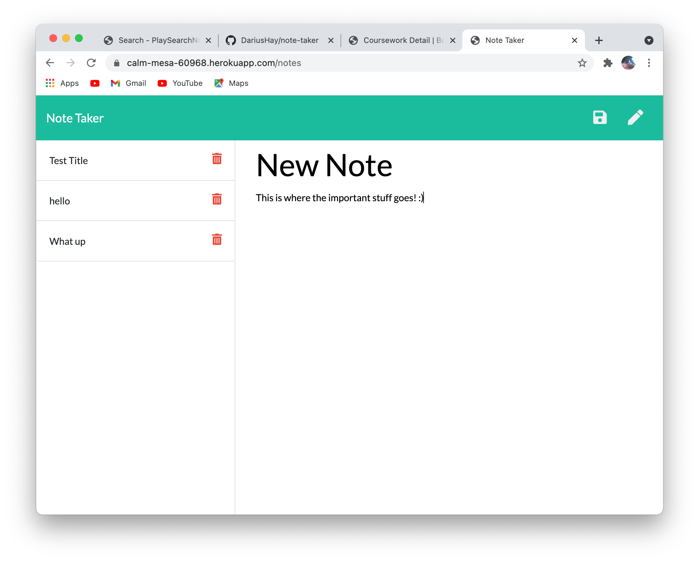

## Project Title

Note Taker

## Description

This application allows users to create, read, update, and delete personal notes.

## Table of Content

1. [Installation requirements](#Installation)
2. [Deployed](#Deployed)
3. [Contributions](#Contributions)
4. [Screenshots](#Screenshots)
5. [Questions](#Questions)

## Installation

HTML, JavaScript, "express", "uuid", "uuidv1", CSS, Heroku

## Deployed

https://calm-mesa-60968.herokuapp.com/

## Contributions

Back-End done by Darius Hay https://github.com/DariusHay

## Screenshots

## Questions

If you have any additional questions about this project, you can find me on GitHub at DariusHay https://github.com/DariusHay, or you can email me at dariushay@gmail.com, thank you.

